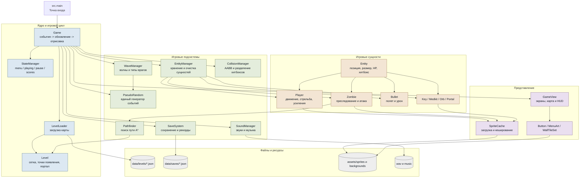

# Архитектура PySurvival

Схема показывает основные слои проекта и направление зависимостей. Центральный
класс `Game` управляет игровым циклом, но передает специализированную работу
отдельным менеджерам.

## Один кадр игры

1. `Game` получает события pygame и передает их активному состоянию.
2. Игрок и враги обновляют позиции; враги строят маршрут через A*.
3. Пространственная сетка отбирает соседние пары, затем AABB обрабатывает
   столкновения, попадания и подбор предметов.
4. `WaveManager` проверяет прогресс волны и создает новых врагов через общий
   `PseudoRandom`.
5. `EntityManager` удаляет неактивные объекты.
6. `GameView` рисует уровень, сущности, HUD и текущий экран интерфейса.

Сохранение фиксирует состояние игрока, текущей волны, живых врагов и предметов.
Поэтому `Continue` восстанавливает прохождение, а не начинает уровень заново.
